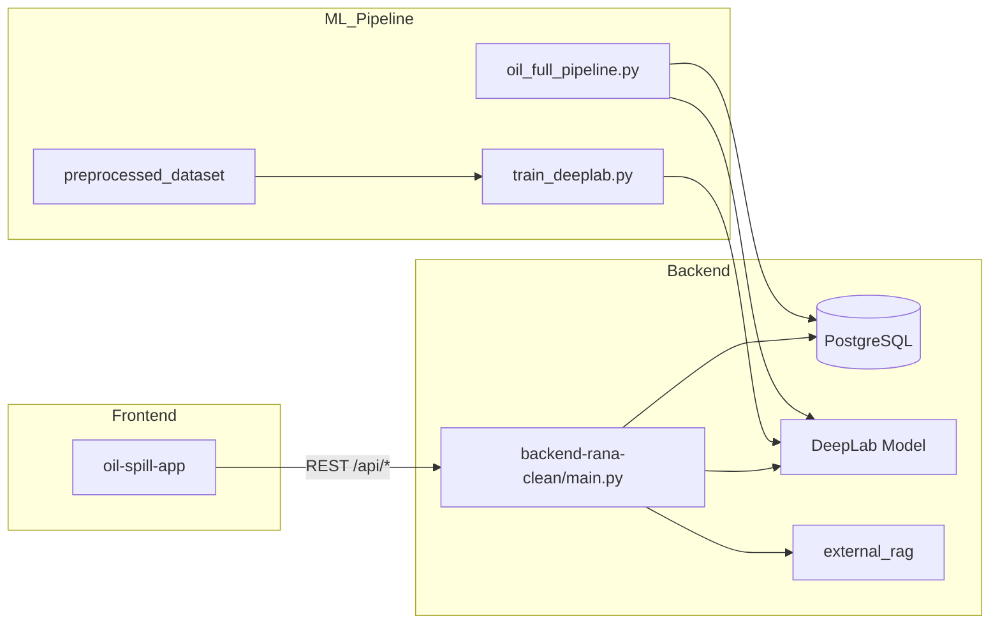

# توثيق مشروع NaftScan (CP)
## نظام كشف تسربات النفط وتحليل المخاطر من صور الأقمار الصناعية

> **آخر تحديث:** مايو 2026  
> **المسار:** `/Users/rana/Documents/tuwaiq/CP`  
> هذا الملف يشرح **هيكل المشروع** و**دور كل مجلد/ملف مهم**. المجلدات الضخمة (آلاف صور `.tif`) موثّقة كنمط وليس ملفًا بملف.

---

## 1. نظرة عامة

المشروع يجمع عدة طبقات:

| الطبقة | التقنية | الوظيفة |
|--------|---------|---------|
| **واجهة المستخدم** | React + Vite + TypeScript | خريطة، تحليل صور، شات بوت، تقارير |
| **API** | FastAPI (`backend-rana-clean`) | قاعدة بيانات، DeepLab، تقارير HTML، شات ذكي |
| **تقسيم (Segmentation)** | DeepLabV3+ (TensorFlow/Keras) | كشف منطقة النفط pixel-level |
| **تحليل جغرافي** | GeoPandas + Shapefiles | قرب اليابسة والشعاب المرجانية |
| **RAG** | ChromaDB + LangChain + Groq | إجابات من وثائق ITOPF |
| **تقارير LLM** | Qwen2.5 + LoRA | توليد تقارير نصية/HTML |



---

## 2. التشغيل السريع

### Backend
```bash
cd backend-rana-clean
python -m venv .venv && source .venv/bin/activate
pip install -r requirements.txt
# عدّلي .env (DB, مسارات المودل, CSV)
uvicorn main:app --reload --port 8000
```

### Frontend
```bash
cd oil-spill-app
npm install
npm run dev
# http://localhost:5173 → يوجّه /api إلى :8000
```

### ملفات حساسة (لا ترفع لـ GitHub)
- `.env` / `backend-rana-clean/.env` — كلمات مرور DB ومفاتيح API
- `full_database.sql` (~2.7 GB) — يتجاوز حد GitHub

---

## 3. الملفات في الجذر (Root)

| الملف | الوصف |
|-------|--------|
| `README.md` | فارغ حاليًا — استخدمي هذا الملف أو `oil-spill-app/README.md` |
| `PROJECT_DOCUMENTATION.md` | **هذا التوثيق** |
| `.env` | إعدادات عامة للمشروع (DB، thresholds) |
| `.gitignore` | يستثني: `.env`, `*.tif`, `*.pt`, `data/`, `outputs/` |
| `.python-version` | إصدار Python المقترح |
| `pyproject.toml` | تعريف مشروع Python (uv/poetry) |
| `requirements.txt` | اعتماديات RAG (LangChain, Groq, Tavily) |
| `full_database.sql` | نسخة احتياطية PostgreSQL كاملة (كبيرة جدًا) |

### تدريب وتقييم DeepLab

| الملف | الوصف |
|-------|--------|
| `train_deeplab.py` | تدريب DeepLabV3+ (MobileNetV2 encoder) — loss: BCE، metrics: accuracy + Dice |
| `train_deeplap_FT.py` | Fine-tuning على مرحلتين (encoder ثم كامل) |
| `best_deeplab.keras` | أفضل مودل بعد التدريب الأول |
| `best_deeplab_stage1.keras` | مودل المرحلة الأولى في FT |
| `best_deeplab_finetuned.keras` | **المودل النهائي** المستخدم في الإنتاج والـ pipeline |
| `deeplab_confusion_matrix.py` | تقييم على test set → IoU, Dice, Precision, Recall |
| `deeplab_confusion_matrix.csv` | Confusion matrix (بكسل) |
| `deeplab_confusion_metrics.csv` | النتائج: IoU≈0.60, Dice≈0.75, threshold=0.5 |
| `deeplab_confusion_matrix.png` | رسم بياني للمصفوفة |
| `test_model.py` | نسخة بديلة لتقييم المودل (sklearn confusion matrix) |

### معالجة البيانات

| الملف | الوصف |
|-------|--------|
| `split_dataset.py` | تقسيم `Oil/` + `masks_fixed_v2/` → train/val/test (70/15/15) |
| `attach_georef_to_masks.py` | إرفاق معلومات georeference بالماسكات |
| `check_masks.py` | فحص سلامة الماسكات |
| `save_predicted_masks.py` | حفظ ماسكات التنبؤ من المودل |

### Pipeline وتحليل

| الملف | الوصف |
|-------|--------|
| `oil_full_pipeline.py` | **Pipeline شامل**: تنبؤ DeepLab → مساحة/تغطية → قرب بر/شعب → CSV → PostGIS → تقارير بصرية |
| `Arabian_Gulf.py` | تحليل بقع من `tif_patches_grayscale` وإخراج تقارير PNG إلى `rno/` |
| `spill_reports_test.py` | توليد تقارير اختبار لمجموعة صور |
| `oil_solution_reports_same_template_no_images.py` | توليد تقارير حلول بنفس قالب HTML بدون صور |

### RAG وتقييم

| الملف | الوصف |
|-------|--------|
| `rag_evaluation.py` | تقييم RAG: Hit Rate, MRR, Source Recall على `eval_questions.json` |
| `eval_questions.json` / `.csv` | أسئلة التقييم (عربي/إنجليزي) |
| `raw_rag_outputs.json` | مخرجات خام لكل سؤال |
| `per_question_results.csv` | نتائج تفصيلية لكل سؤال |
| `summary.json` | ملخص مقاييس التقييم |
| `main.py` | placeholder بسيط (`Hello from rag2!`) — ليس الـ API الرئيسي |
| `check_db.py` | فحص ChromaDB collections في مسارات Windows |

### LLM / Hugging Face

| الملف | الوصف |
|-------|--------|
| `prepare_oil_tokenized_dataset.py` | سحب `spill_analysis_results` من PostgreSQL → tokenize → رفع HF |

---

## 4. المجلدات الرئيسية

### `oil-spill-app/` — الواجهة الأمامية (React)

| المسار | الوصف |
|--------|--------|
| `package.json` | اعتماديات: React, Leaflet, Tailwind, Framer Motion |
| `vite.config.ts` | Proxy: `/api` → `localhost:8000` |
| `tailwind.config.js` | ألوان المشروع (navy/teal/risk) |
| `src/main.tsx` | نقطة الدخول |
| `src/App.tsx` | التوجيه (Routes) |
| `src/lib/api.ts` | **كل استدعاءات الـ API** للباكند |
| `src/lib/i18n.ts` | نصوص عربي/إنجليزي |
| `src/lib/utils.ts` | دوال مساعدة (cn, تنسيق) |
| `src/hooks/useApi.ts` | `useSpills`, `useReports` |
| `src/hooks/useLang.tsx` | سياق اللغة + RTL |
| `src/types/index.ts` | أنواع TypeScript (Spill, Report, Chat) |
| `src/components/Layout.tsx` | الهيدر والتنقل |
| `src/components/ui/` | Button, Card, Badge |
| `src/pages/Home.tsx` | الصفحة الرئيسية + إحصائيات |
| `src/pages/MapPage.tsx` | خريطة Leaflet مع علامات المخاطر |
| `src/pages/Analyze.tsx` | رفع صورة → `/api/analyze-image` |
| `src/pages/Chatbot.tsx` | شات ذكي + مقارنة تسربات + تقارير |
| `src/pages/Reports.tsx` | قائمة وتوليد التقارير HTML |
| `src/pages/Solutions.tsx` | بحث حلول تلوث نفطي |
| `src/pages/About.tsx` | عن المشروع والـ pipeline |

---

### `backend-rana-clean/` — الباكند الرئيسي (FastAPI)

| المسار | الوصف |
|--------|--------|
| `main.py` | **قلب النظام** (~5700 سطر): DB, DeepLab, تقارير, شات, RAG |
| `requirements.txt` | FastAPI, SQLAlchemy, rasterio, tensorflow, geopandas... |
| `.env` | `DB_*`, `CSV_PATH`, `CP_PATH`, `PREDICTION_THRESHOLD`, مفاتيح Groq |
| `README_RANA.md` | تعليمات تشغيل ومطابقة الفرونت |
| `generated_upload_spills/spills.jsonl` | تسربات مرفوعة محليًا |
| `generated_solution_reports/reports.jsonl` | تقارير حلول محفوظة |

#### أهم Endpoints في `main.py`

| Endpoint | الوظيفة |
|----------|---------|
| `GET /` | Health + معلومات النظام |
| `GET /api/debug/db` | فحص اتصال PostgreSQL |
| `GET /api/spills` | قائمة التسربات (فلتر مخاطر) |
| `GET /api/spills/{id}` | تفاصيل تسرب واحد |
| `POST /api/analyze-image` | رفع صورة → DeepLab → mask + metrics |
| `POST /api/save-analysis` | حفظ نتيجة التحليل |
| `POST /api/chat` | شات بوت ذكي (DB / RAG / مقارنة / meta) |
| `POST /api/generate-report` | تقرير HTML عربي/إنجليزي |
| `GET /api/reports` | قائمة التقارير |
| `GET /api/reports/{id}` | عرض HTML للتقرير |
| `POST /api/solutions` | بحث حلول مع مصادر موثوقة |
| `POST /api/rag/ask` | سؤال مباشر لـ RAG |
| `GET /api/rag/health` | حالة فهرس RAG |

---

### `external_rag/` — نظام RAG الخارجي

| الملف | الوصف |
|-------|--------|
| `rag_build_index.py` | بناء فهرس ChromaDB من PDFs |
| `build_rag_index_mac.py` | نسخة macOS لبناء الفهرس |
| `rag_query.py` | استعلام RAG |
| `search_response_agent.py` | وكيل بحث + Groq لتوليد إجابة من مصادر |
| `agent_module.py` | منطق الوكيل |
| `Rag_add_files.py` | إضافة مستندات للفهرس |
| `rag_streamlit.py` | واجهة Streamlit للتجربة |
| `streamlit_unified_app.py` | تطبيق Streamlit موحّد |
| `Unified assistant.py` | مساعد موحّد (تجريبي) |
| `run_*_full_project.py` | سكربتات تشغيل pipeline كامل على صور محددة |
| `rag_documents/` | ملفات PDF (وثائق ITOPF) |
| `rag_db/` | نسخة محلية من ChromaDB |

---

### `oil_llm_reporter/` — تقارير LLM محلية

| المسار | الوصف |
|--------|--------|
| `run_local_oil_llm.py` | تشغيل Qwen2.5 + LoRA لتوليد تقارير من DB |
| `generate_db_reports_html.py` | توليد HTML من قاعدة البيانات |
| `models/` | النموذج الأساسي Qwen2.5-0.5B-Instruct |
| `oil_qwen_lora_adapter/` | أوزان LoRA المدربة + tokenizer + عينات |

---

### `LLM/` — تجارب Notebook

| الملف | الوصف |
|-------|--------|
| `notebook_09_fixed2.ipynb` | تجارب تدريب/توليد LLM |
| `notebook_09_fixed (1).ipynb` | نسخة بديلة |
| `content/`, `content 2/` | بيانات/محتوى للـ notebooks |

---

### بيانات الصور والماسكات

| المجلد | الوصف | الحجم التقريبي |
|--------|--------|----------------|
| `Oil/` | صور TIFF الأصلية للتسربات (`00000.tif`, ...) | ~1200+ ملف |
| `masks_fixed_v2/` | ماسكات Ground Truth مطابقة للصور | ~1200+ ملف |
| `preprocessed_dataset/` | بعد التقسيم: `images/{train,val,test}` + `masks/...` | للتدريب |
| `dataset_split/` | نسخة تقسيم بديلة | |
| `predicted_masks/` | ماسكات تنبؤ المودل (train/test) | |
| `tif_patches_grayscale/` | بقع (patches) رمادية للتجارب | ~390 patch |
| `backend_uploads/` | صور مرفوعة من الواجهة + mask/overlay | |
| `backend_model_outputs/` | ماسكات PNG من تحليلات سابقة | |

> **ملاحظة:** ملفات `.tif` مستثناة من Git بسبب الحجم.

---

### بيانات جغرافية (GIS)

| المجلد | الوصف |
|--------|--------|
| `ne_10m_land/` | Shapefile يابسة عالمية (Natural Earth) — حساب المسافة للبر |
| `Global_Coral_Reef_Points/` | نقاط الشعاب المرجانية — حساب المسافة للشعب |

---

### مخرجات Pipeline والتقارير

| المجلد | الوصف |
|--------|--------|
| `full_pipeline_output/` | مخرجات `oil_full_pipeline.py` |
| `full_pipeline_output/predicted_masks/` | ماسكات التنبؤ |
| `full_pipeline_output/visual_reports/` | صور تقرير مرئية لكل spill |
| `full_pipeline_output/spill_analysis_results_full.csv` | جدول تحليل كامل |
| `full_pipeline_output/model_test_metrics.json` | مقاييس المودل |
| `spill_reports_test/` | تقارير PNG تجريبية |
| `rno/` | مخرجات `Arabian_Gulf.py` |
| `final_html_reports/` | تقارير HTML نهائية (LLM) |
| `final_response_reports_150/` | 150 تقرير استجابة + `index.html` |
| `solution_reports_output/` | تقارير الحلول |
| `hf_oil_spill_tokenized_dataset/` | Dataset جاهز لـ Hugging Face (jsonl + arrow) |

---

### قواعد البيانات

| المسار | الوصف |
|--------|--------|
| `rag_db/` (جذر) | ChromaDB للمشروع الرئيسي |
| `full_database.sql` | Dump كامل PostgreSQL (spills, reports, analysis) |
| PostgreSQL `oil_spills` | الجداول الرئيسية: spills, reports, spill_analysis_results |

---

## 5. تدفق العمل (Workflow)

### أ) من الصورة إلى التقرير

```
صورة TIFF (Oil/)
    → split_dataset.py → preprocessed_dataset/
    → train_deeplab.py / train_deeplap_FT.py → best_deeplab_finetuned.keras
    → deeplab_confusion_matrix.py → مقاييس IoU/Dice
    → oil_full_pipeline.py → CSV + PostGIS + visual_reports
    → backend-rana-clean → API للواجهة
    → oil-spill-app → خريطة + تقارير + شات
```

### ب) الشات البوت

```
سؤال المستخدم (Chatbot.tsx)
    → POST /api/chat
    → تصنيف النية (intent): DB / RAG / مقارنة / حلول / meta
    → إجابة من PostgreSQL أو external_rag أو منطق مدمج
```

### ج) التقييم

| المقياس | الملف | القيمة |
|---------|-------|--------|
| IoU (رئيسي) | `deeplab_confusion_metrics.csv` | ~0.60 |
| Dice | نفس الملف | ~0.75 |
| RAG Hit Rate | `summary.json` | من `rag_evaluation.py` |

---

## 6. ملفات الإعداد والبيئة

| الملف | محتوى typical |
|-------|----------------|
| `backend-rana-clean/.env` | `DB_HOST`, `DB_PASSWORD`, `CSV_PATH`, `CP_PATH`, `GROQ_API_KEY`, `PREDICTION_THRESHOLD=0.01` |
| `.env` (جذر) | إعدادات مشتركة |
| `.vscode/settings.json` | إعدادات Cursor/VS Code |

---

## 7. ما يُستثنى من Git (`.gitignore`)

- `.env`, `*.env`
- `*.tif`, `*.tiff`, `*.pt`, `*.pth`, `*.h5`
- `data/`, `datasets/`, `outputs/`, `runs/`
- `.venv/`, `node_modules/`, `__pycache__/`

**يعني:** المودل `.keras` والكود يُرفعان، لكن آلاف الصور والـ DB dump الكبير قد تحتاج Git LFS أو تخزين خارجي.

---

## 8. خريطة سريعة: أي ملف أستخدم؟

| أريد أن... | افتحي |
|------------|--------|
| أشغّل الموقع | `backend-rana-clean/` + `oil-spill-app/` |
| أدرّب المودل | `train_deeplab.py` → `train_deeplap_FT.py` |
| أقيّم IoU | `deeplab_confusion_matrix.py` |
| أشغّل pipeline كامل | `oil_full_pipeline.py` |
| أعدّل التقارير العربية | `backend-rana-clean/main.py` (دوال `_fr_*`) |
| أعدّل الشات | `backend-rana-clean/main.py` + `Chatbot.tsx` |
| أقيّم RAG | `rag_evaluation.py` |
| أولّد تقارير LLM | `oil_llm_reporter/run_local_oil_llm.py` |
| أفهم الفرونت | `oil-spill-app/README.md` |

---

## 9. ملاحظات مهمة

1. **`main.py` في الجذر ≠ API** — الـ API الحقيقي في `backend-rana-clean/main.py`.
2. **مسارات ثابتة** في بعض السكربتات تشير لـ `/Users/rana/...` — عدّليها عند النقل لجهاز آخر.
3. **`PREDICTION_THRESHOLD`**: التقييم عند `0.5`، التشغيل غالبًا عند `0.01` (حساسية أعلى).
4. **`full_database.sql`**: لا يناسب GitHub العادي (حد 100MB) — استخدمي استثناء أو رفع منفصل.

---

*للتحديث: أضيفي قسمًا جديدًا عند إضافة ميزة، أو شغّلي Agent لتحديث هذا الملف تلقائيًا.*
